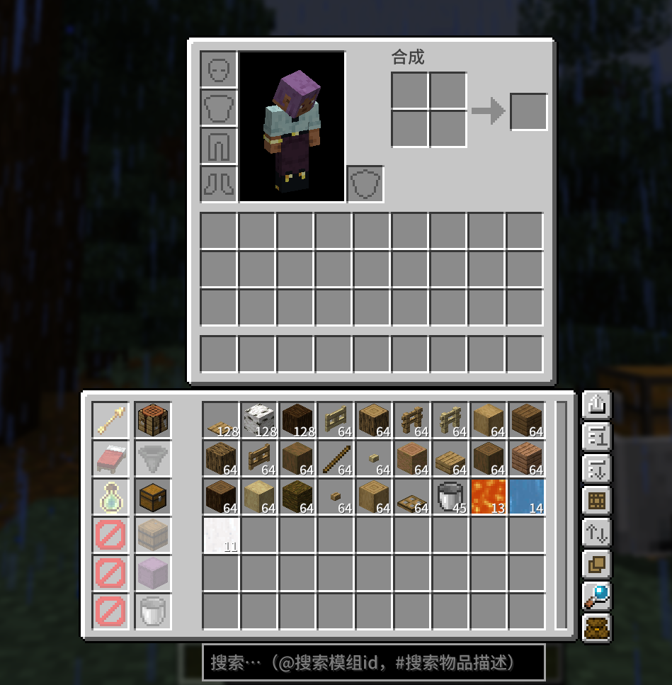

# Portable Storage

## 项目简介

**Portable Storage** 是一个基于 [Fabric](https://fabricmc.net/) 和 [Fabric API](https://www.curseforge.com/minecraft/mc-mods/fabric-api) 的 Minecraft 模组，为玩家提供随身仓库功能。仓库目前采用无限堆叠设计，按物品变体（含组件和NBT数据）进行智能存储，支持多玩家共享和自动化设备交互。

## 主要特性

这个模组为玩家背包UI上方添加一个仓库界面，界面顶部有搜索栏（支持搜索物品名称、模组ID、物品描述），下方显示仓库中存放的物品，可以自由拿取和放入物品。

仓库界面左侧有5个升级槽位，可以放入特定物品以解锁仓库的额外功能，右侧是仓库设置面板。

## 模组UI

<!--  -->
<!--  -->

### 升级（放入升级槽位的物品，右键升级槽位可停用）：

- **工作台**：在工作台界面底部显示仓库界面，支持合成补充功能（自动从仓库补充物品到合成格）
- **漏斗**：自动拾取周围5格范围内的掉落物到仓库中
- **箱子**：增加扩展升级槽6个
- **木桶**：创建绑定容器，支持多玩家仓库共享和自动化设备访问：
  - 放入槽位后升级为带有绑定的特殊容器
  - 取出槽位后作为方块放置，右键打开可存入物品到仓库
  - 自动化设备可以从绑定木桶中提取/存入玩家仓库物品
  - 放入其它玩家的绑定木桶可与其共享仓库（合并显示）
  - 支持多玩家共享同一仓库，但有防循环机制
- **潜影盒**：暂未实现

### 扩展升级槽

- **光灵箭**：射出的普通箭矢将使目标获得10s的发光效果
- **床**：右键启用的床升级原地睡觉（不记录重生点）
- **附魔之瓶**：在仓库显示“瓶装经验”
  - 右键点击槽位切换存取等级（1、5、10、100）
  - 中键点击槽位切换“等级维持”功能的启用状态
  - 等级维持：将维持玩家等级为当前等级，变化时会将多的存入少的取出
  - 空手右键瓶装经验存入相应等级的经验，左键取出
  - 持有空玻璃瓶右键瓶装经验以11点经验换1个附魔之瓶，经验不足时多出的玻璃瓶会被放入仓库

### 客户端设置

以下设置保存在客户端，重启游戏和切换界面不会丢失：

- **折叠仓库**：将仓库界面折叠为一个选项卡形式显示
- **排序方案**：支持四种排序方式：
  - 数量（按物品数量排列）
  - 物品名称（按字母顺序）
  - 模组ID（按模组名称）
  - 更新时间（最近操作的物品优先）
- **排序顺序**：可切换正序（升序）或倒序（降序）
- **合成补充**：在合成台界面使用时，自动从仓库补充物品到合成格，支持连续合成
- **自动传入**：使用Shift+左键点击物品时，优先将物品存入仓库而非背包或快捷栏
- **智能折叠**：折叠因nbt不同导致无法折叠的物品，搜索时展开（右键折叠自动搜索）
- **搜索位置**：调整搜索栏的位置：
  - 底部：显示在仓库UI下方
  - 顶部：在玩家背包UI上方（靠近）
  - 顶部2：在玩家背包UI上方（更靠上）
  - 中间：插入在背包UI和仓库UI之间

### 其它机制

- 弓和弩的箭矢支持从仓库扣除（无限则不扣）

### 机制说明

[机制说明](docs/机制说明.md)

**包含：**

- 绑定木桶的详细说明

### 配置

1. 客户端配置

`config\portable-storage-client.json`

2. 服务端配置

`config\portable-storage-server.toml`

具体配置说明查 [配置说明](docs/配置.md)

## 系统要求

- **Minecraft 版本**：1.21
- **Java 版本**：Java 21 或更高
- **Fabric Loader**：0.17.2 或更高版本
- **Fabric API**：兼容版本（推荐最新稳定版）

## 适配

- **EMI**：1.1.10+1.21（仅在工作台升级时在工作台界面有效）

## 安装方法

1. 安装 [Fabric Loader](https://fabricmc.net/use/) 和 [Fabric API](https://www.curseforge.com/minecraft/mc-mods/fabric-api)。
2. 下载本模组的 jar 文件，放入 `mods` 文件夹。
3. 启动游戏，模组会自动加载。

## 配置说明

- 无

## 开发与贡献

欢迎提交 Issue 或 PR 参与开发！

[开发说明](docs/开发说明.md)

## 致谢与协议

- 本项目由 LoosePrince 开发，遵循 MIT 协议。
- 感谢 Fabric 社区及所有开源贡献者。

---

如有建议或问题，欢迎在 Issue 区留言反馈！
