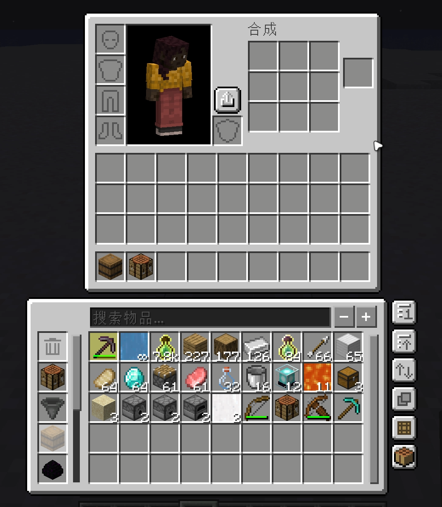

# Portable Storage

  
   
  Portable Storage 2

> 注意！
> 本项目使用AI编写了99.99%的代码和模组设计，我并不会Java。
> 这意味着，我将无法保证模组的可用性、兼容性、稳定性，请确保你能接受并有能力保护好的数据再使用本模组。

## 项目简介

**Portable Storage** 是一个基于 [Fabric](https://fabricmc.net/) 和 [Fabric API](https://www.curseforge.com/minecraft/mc-mods/fabric-api) 的 Minecraft 模组，为玩家提供随身仓库功能。仓库目前采用无限堆叠设计，按物品变体（含组件和NBT数据）进行智能存储，支持多玩家共享和自动化设备交互。

无限并非真无限，单种物品最大为Long.MAX_VALUE

### 相关链接

- MOD百科：https://www.mcmod.cn/class/22574.html
- modrinth：https://modrinth.com/mod/portable-storage/
- curseforge：https://www.curseforge.com/minecraft/mc-mods/portable-storage

## 主要特性

这个模组为玩家背包UI中添加一个仓库界面，界面有搜索栏，下方显示仓库中存放的物品，可以自由拿取和放入物品。

仓库界面左侧有升级槽位，可以放入特定物品以解锁仓库的额外功能，右侧是仓库设置面板。

你可以使用一个海洋之心来激活一个初级的仓库，它有一些限制。

或者你可以使用一个下届之星来激活一个完整的仓库，它没有限制。

初级仓库中被限制的功能：绑定木桶的共享功能，存储的物品种类

## 模组UI

### 升级（放入升级槽位的物品，右键升级槽位可停用）：

- **工作台**：在仓库界面右侧显示打开合成界面功能，启用背包界面3x3合成。
- **漏斗**：自动拾取周围5格范围内的掉落物到仓库中
  - 中键点击槽位打开筛选界面，可以配置过滤，支持黑白名单制
- **木桶**：创建绑定容器，支持多玩家仓库共享和自动化设备访问：
  - 放入槽位后升级为带有绑定的特殊容器
  - 取出槽位后作为方块放置，右键打开放入标记物品以启用交互，白名单制
  - 自动化设备可以从绑定木桶中提取/存入玩家仓库物品
  - 放入其它玩家的绑定木桶可与其共享仓库（合并显示）
- **龙蛋（裂隙升级）**：右键进入 `裂隙` **维度**
  - 私人空间，16x16大小（一个区块），可以配置大小
  - 裂隙区块加载跟随玩家，无论是否在裂隙中
  - 裂隙永昼且无需照明
  - 玩家离开裂隙会生成“复制体”代替玩家接受效果（你可以在裂隙中放信标来获得信标效果）
  - 在裂隙中死亡时仓库钥匙会掉落在进入裂隙前的位置
  - 掉入裂隙虚空的话会退出裂隙且不会生成复制体
- **光灵箭**：射出的普通箭矢将使目标获得10s的发光效果
- **床**：右键启用的床升级原地睡觉（不记录重生点）
- **附魔之瓶**：在仓库显示“瓶装经验”
  - 右键点击槽位切换存取等级（`1、5、10、100`）
  - 中键点击槽位切换“等级维持”功能的启用状态
  - 等级维持：将维持玩家等级为当前等级，变化时会将多的存入少的取出
  - 空手右键瓶装经验存入相应等级的经验，左键取出
  - 持有空玻璃瓶右键瓶装经验以11点经验换1个附魔之瓶，经验不足时多出的玻璃瓶会被放入仓库
- **活塞**：自动补充主副手物品，手持活塞左键可旋转方块旋转
- **附魔金苹果**：自动喂食，可选低于2、4、6、...、20时自动喂食或者禁用
  - 中键打开筛选界面，逻辑同漏斗升级的过滤功能

### 特殊槽位

- **垃圾桶**：有箱子升级即可用，可以放入任何物品，位于扩展升级槽位顶部
  - 物品会在退出存档或离线时销毁
  - 使用不同的物品覆盖以销毁
  - 在销毁前可以取出物品

### 仓库右侧设置面板

- **折叠仓库**：位于副手槽位上方，右键点击将仓库界面折叠为一个选项卡形式显示
- **排序方案**：支持四种排序方式：
  - 数量（按物品数量排列）
  - 物品名称（按字母顺序）
  - 模组ID（按模组名称）
  - 更新时间（最近操作的物品优先）
- **排序顺序**：可切换正序（升序）或倒序（降序）
- **合成补充**：在合成台界面使用时，自动从仓库补充物品到合成格，支持连续合成
- **快捷存取**：使用 `Shift+左键` 点击物品时，优先将物品存入仓库而非背包或快捷栏
- **智能折叠**：折叠因nbt不同导致无法折叠的物品，搜索时展开（右键折叠自动搜索）
- **打开合成**：点击打开工作台界面

### 其它机制

- 流体储存：通过快速存取将流体存入仓库，支持岩浆、水、牛奶
- 弓和弩的箭矢支持从仓库扣除（无限则不扣）
- 在仓库中对物品中键可以将其设为收藏和取消收藏，收藏物品会排在其它物品前面
- 拼音搜索：可以首字母
- 隐藏背包界面的配方书按钮（默认启用，可以配置禁用）
- 快速存取（自动传入补充）：光标持有物品时，按住shift+双击相同物品，会将背包中全部相同物品存入仓库
- 无限流体：流体在仓库中数量大于阈值时数量显示∞（无限），存取都不会使其数量变化
  - 岩浆阈值默认10000，水阈值默认2
- 物品大小限制：仓库会检查单个物品的大小，如果超过限制则无法存入
- 快捷键：可以去游戏设置中配置快速打开仓库合成界面的快捷按键，创造模式可用。

### 机制说明

[机制说明](docs/机制说明.md)

## 系统要求

- **Minecraft 版本**：
  - 1.20.1：测试版本，无2.x版本
  - 1.21：2.x版本
  - 1.21.1：未测试
- **Fabric API**：兼容版本（推荐最新稳定版）

## 适配

- **EMI**：在工作台升级提供的合成界面支持从仓库提取物品进行配方填充
- **JEI**：支持背包界面和工作台升级提供的合成界面提供从仓库提取物品进行配方填充

更多适配逐渐扩展中...

## 开发与贡献

欢迎提交 Issue 或 PR 参与开发！

[开发说明](docs/开发说明.md)

## 致谢与协议

- 本项目由 LoosePrince 开发，遵循 MIT 协议。
- 1.x版本拼音搜索使用 [TinyPinyin](https://github.com/promeG/TinyPinyin)
- 2.x版本拼音搜索使用 [JPinyin](https://github.com/stuxuhai)
- 配置使用 Night Config
- 数据储存使用 [Cardinal Components API](https://github.com/Ladysnake/Cardinal-Components-API)
- 感谢 Fabric 社区及所有开源贡献者。

### 创意和意见提供者

- 感谢 [雪开](https://github.com/XueK66) 提出的光灵箭升级和床升级想法
- 感谢群友 [小泽](https://github.com/Dreamwxz) 提出的裂隙升级和装填想法
- 感谢群友 PMCK 提出的经验瓶升级想法和床升级实现思路
- 感谢群友 酸甜＆牛奶 提出的流体储存想法
- 感谢B站用户 [恋雪绊人心](https://space.bilibili.com/6317479) 发现的大量BUG和性能问题，和协助测试

---

如有建议或问题，欢迎在 Issue 区或Q群726741344留言反馈！
